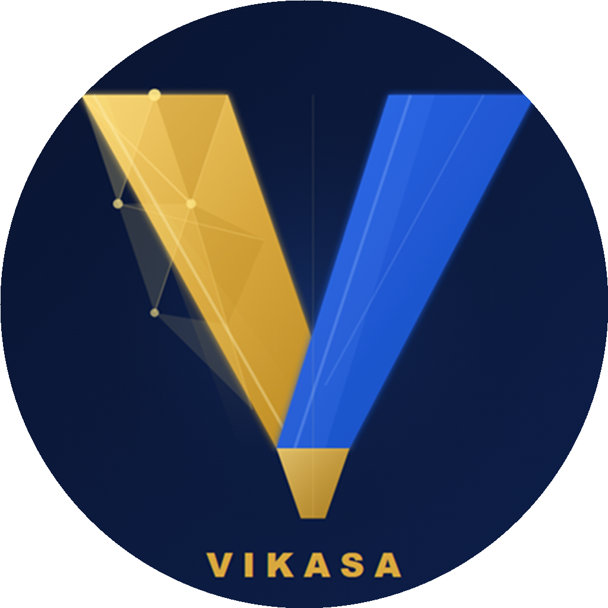

<p align="center">
  
</p>

<h1 align="center">Vikasa Network (VIK)</h1>
<p align="center">A Polygon-based Web3 Rewards Ecosystem</p>

<p align="center">
  <a href="https://polygonscan.com/token/0x2921d67ac78ebda0020f952e51e931ed125e00c1">Verified Contract</a> ·
  <a href="https://www.vikasanetwork.com">Website</a> ·
  <a href="https://play.google.com/store/apps/details?id=com.vikasa.app">Android App</a> ·
  <a href="https://www.vikasanetwork.com/whitepaper.pdf">Whitepaper</a>
</p>

---

## 📖 Overview

Vikasa Network is a Polygon-powered Web3 rewards ecosystem where users earn VIK utility tokens through daily rewards, missions, referrals, and community engagement — all inside a mobile-first app that is **live today**.

We believe trust is earned through transparency, so this repository documents exactly what is live, what is planned, and how the VIK token supply is allocated and controlled.

## 🚀 Current Status

| Component | Status |
|-----------|--------|
| Android Application | ✅ Live |
| Official Website | ✅ Live |
| Smart Contract (Polygon PoS) | ✅ Deployed & Verified |
| Whitepaper | ✅ Published |
| GitHub Documentation | ✅ Public |
| Daily Rewards & Streaks | ✅ Live |
| Watch & Earn | ✅ Live |
| Missions & Social Tasks | ✅ Live |
| Referral Program (2-Tier) | ✅ Live |
| Community Feed & Messaging | ✅ Live |
| Leaderboards & Achievements | ✅ Live |
| VIK Token Locking | ✅ Live |
| Independent Smart Contract Audit | 🔜 Phase 2 |
| Token Withdrawals | 🔜 Phase 2 |
| DEX Liquidity | ⏳ Phase 3 |

> **Why can't I withdraw yet?** See the [FAQ](#-faq) below — we answer this directly.

## 🪙 VIK Token

| Property | Value |
|----------|-------|
| Token Name | Vikasa Network |
| Symbol | VIK |
| Blockchain | Polygon PoS |
| Standard | ERC-20 (OpenZeppelin) |
| Decimals | 18 |
| Maximum Supply | 24,000,000 VIK (fixed, no minting) |
| Contract | [`0x2921d67ac78ebda0020f952e51e931ed125e00c1`](https://polygonscan.com/token/0x2921d67ac78ebda0020f952e51e931ed125e00c1) |

### Token Allocation

| Allocation | Amount (VIK) | % of Supply | Purpose |
|------------|-------------|-------------|---------|
| Community Rewards & Engagement | 12,000,000 | 50% | Daily claims, task rewards, referral bonuses, leaderboard prizes |
| Liquidity & Exchange Listings | 4,800,000 | 20% | DEX/CEX liquidity provision and long-term market stability |
| Ecosystem & Development | 3,600,000 | 15% | Protocol development, infrastructure, operational costs |
| Team & Advisors | 2,400,000 | 10% | Founders and core contributors — subject to a 2-year vesting lock |
| Strategic Reserve | 1,200,000 | 5% | Contingency, future partnerships, and ecosystem expansion |

**Half of the entire VIK supply is reserved for the community.** The team allocation (10%) is subject to a 2-year vesting lock — on-chain lock proof will be published on this page once allocation wallets are live (see below).

## 🔍 Transparency & Wallets

We are committed to full on-chain transparency. Dedicated allocation wallets are currently being set up so that each allocation above can be independently verified on PolygonScan.

| Wallet | Address | Status |
|--------|---------|--------|
| Token Contract | [`0x2921...00c1`](https://polygonscan.com/token/0x2921d67ac78ebda0020f952e51e931ed125e00c1) | ✅ Live & Verified |
| Community Rewards Pool | *To be published* | 🔜 Wallet separation in progress |
| Liquidity Reserve | *To be published* | 🔜 Wallet separation in progress |
| Ecosystem & Development | *To be published* | 🔜 Wallet separation in progress |
| Team & Advisors (2-year lock) | *To be published* | 🔜 Lock proof will be linked here |
| Strategic Reserve | *To be published* | 🔜 Wallet separation in progress |

Once published, every large VIK transfer visible on PolygonScan should match one of the wallets above. If you ever see a movement you can't explain, ask us in [Telegram](https://t.me/vikasanetwork) — we will explain it.

**Security & verification:**
- ✅ [PolygonScan Verified Source Code](https://polygonscan.com/token/0x2921d67ac78ebda0020f952e51e931ed125e00c1)
- ✅ [GoPlus Security Scan](https://gopluslabs.io/token-security/137/0x2921d67ac78ebda0020f952e51e931ed125e00c1)
- ✅ [Blockspot Listing](https://blockspot.io/coin/vikasa-network-vik/)
- ✅ Built with [OpenZeppelin](https://www.openzeppelin.com/) audited libraries
- 🔜 Independent third-party audit — Phase 2 (report will be published in full in this repository)

## ❓ FAQ

**When can I withdraw my VIK?**
Token withdrawals launch in Phase 2, after the independent smart contract audit is published. We deliberately sequenced it this way: we will not ask users to move tokens on-chain before an independent auditor has reviewed the contracts. Until then, all earned VIK is recorded to your account and visible in your in-app wallet.

**How are rewards funded?**
Rewards are funded from the fixed 12,000,000 VIK Community Rewards allocation (50% of total supply) and sustained by advertising revenue (Google AdMob rewarded ads) and future ecosystem services. VIK has a fixed supply of 24,000,000 — no new tokens can ever be minted.

**Is VIK an investment?**
No. VIK is a utility token for participation within the Vikasa Network ecosystem. It is not offered or promoted as an investment, and nothing in this repository is financial advice.

**Who is behind Vikasa Network?**
Vikasa Network is built by a core team of founders and contributors. Team details are shared through our official channels — see our [LinkedIn](https://www.linkedin.com/company/vikasanetwork) and [website](https://www.vikasanetwork.com). The team allocation is subject to a public 2-year vesting lock.

**What happens to my tokens if the app shuts down?**
VIK is an ERC-20 token on Polygon PoS. Once withdrawals are live, tokens you withdraw are held in your own wallet, under your own keys — independent of our servers or app.

## ✨ App Features

- 🎁 Daily Reward Claims & 🔥 Streaks
- 📺 Watch & Earn (rewarded ads)
- ✅ Missions & Social Tasks
- 🏆 Achievements & Leaderboards
- 👥 Two-Tier Referral Program
- 💬 Community Feed & 📩 Private Messaging
- 👛 Built-in VIK Wallet
- 🔒 VIK Token Locking (6 months – 3 years)
- 📢 Announcements & 🔔 Push Notifications

## 🛠 Technology Stack

| Layer | Technology |
|-------|------------|
| Mobile App | Flutter |
| Backend | Supabase |
| Blockchain | Polygon PoS |
| Smart Contracts | Solidity + OpenZeppelin |
| Rewarded Ads | Google AdMob |
| Notifications | Firebase Cloud Messaging |

## 🛣 Roadmap

### ✅ Phase 1 — Foundation (Complete)
- Android app launch
- Daily rewards, streaks, missions
- Two-tier referral program
- Community feed, messaging, leaderboards
- VIK token locking
- PolygonScan contract verification

### 🔜 Phase 2 — Trust & Access
- **Allocation wallets published** with on-chain team lock proof
- **Independent smart contract audit** (report published publicly)
- **Token withdrawals** to users' own Polygon wallets
- KYC verification
- iOS application
- Trust Wallet recognition
- Premium membership

### ⏳ Phase 3 — Markets & Governance
- DEX liquidity (locked LP, proof published)
- CoinGecko & CoinMarketCap listings
- WalletConnect integration
- NFT rewards
- DAO governance
- Centralized exchange listings

> Our sequencing is deliberate: **audit → withdrawals → liquidity → listings.** Users get security review and self-custody access *before* VIK has a market price.

## 📂 Repository Structure

```text
.
├── assets/        # Logos and brand assets
├── images/        # Screenshots and media
├── docs/          # Extended documentation
├── LICENSE
└── README.md
```

## 🌐 Official Links

| Resource | Link |
|----------|------|
| Website | https://www.vikasanetwork.com |
| Google Play | https://play.google.com/store/apps/details?id=com.vikasa.app |
| Whitepaper | https://www.vikasanetwork.com/whitepaper.pdf |
| PolygonScan | https://polygonscan.com/token/0x2921d67ac78ebda0020f952e51e931ed125e00c1 |
| X (Twitter) | https://x.com/vikasanetwork |
| Telegram | https://t.me/vikasanetwork |
| LinkedIn | https://www.linkedin.com/company/vikasanetwork |
| Instagram | https://www.instagram.com/vikasanetwork |

⚠️ **These are our only official channels.** We will never DM you first, never ask for your seed phrase, and never ask you to send funds. Report impersonators to info@vikasanetwork.com.

## ⚠️ Disclaimer

VIK is a utility token intended solely for participation within the Vikasa Network ecosystem. It is not an investment product, security, or financial instrument, and no statement in this repository should be treated as financial advice. Participation in the ecosystem involves risk; users should do their own research.

## 📄 License

Copyright © 2026 Vikasa Network. All rights reserved.

The Vikasa Network name, logo, brand assets, and documentation in this repository may not be copied, modified, or redistributed without written permission. This protects our community from impersonation and counterfeit projects.

## 📬 Contact

- 🌐 Website: https://www.vikasanetwork.com
- 📧 Email: info@vikasanetwork.com
- 💬 Telegram: https://t.me/vikasanetwork
- 🐦 X: https://x.com/vikasanetwork
