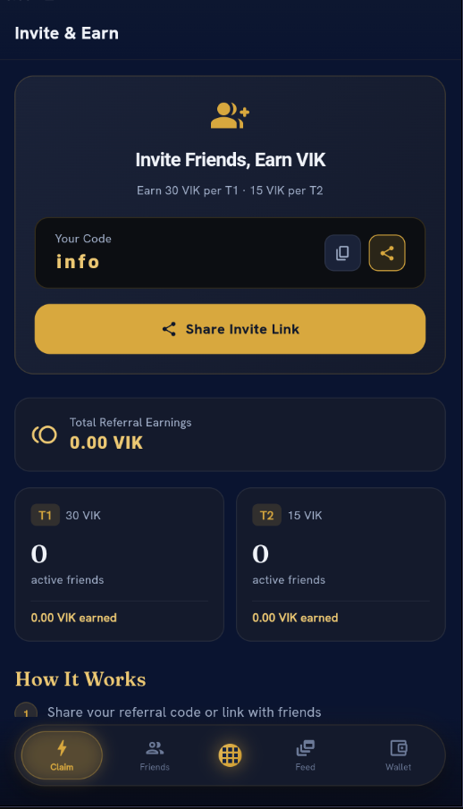

  

<h1 align="center">Vikasa Network (VIK)</h1>

<strong>A Polygon-based Web3 Rewards Ecosystem</strong>

<a href="https://www.vikasanetwork.com">Website</a> •
<a href="https://play.google.com/store/apps/details?id=com.vikasa.app">Android App</a> •
<a href="https://polygonscan.com/token/0x2921d67ac78ebda0020f952e51e931ed125e00c1">Verified Contract</a> •
<a href="https://blockspot.io/coin/vikasa-network-vik/">Blockspot</a> •
<a href="https://github.com/vikasanetwork/vikasa-network-docs">Documentation</a>

---

# Overview

Vikasa Network is a Polygon-powered Web3 rewards ecosystem where users earn **VIK** through daily rewards, missions, referrals, community participation and other in-app activities.

The project focuses on transparency, verified smart contracts, and sustainable ecosystem growth.

---

# App Preview

| Home | Earn | Token Lock | Wallet | Referrals |
|:---:|:---:|:---:|:---:|:---:|
|  |  |  |  |  |

---

# Current Status

| Component | Status |
|-----------|--------|
| Android App | ✅ Live |
| Website | ✅ Live |
| Smart Contract | ✅ Verified |
| Whitepaper | ✅ Published |
| Documentation | ✅ Public |
| Daily Rewards | ✅ Live |
| Missions | ✅ Live |
| Referral Program | ✅ Live |
| Community Feed | ✅ Live |
| Token Locking | ✅ Live |
| Audit | 🔜 Phase 2 |
| Withdrawals | 🔜 Phase 2 |
| DEX Liquidity | ⏳ Phase 3 |

---

# VIK Token

- **Network:** Polygon PoS
- **Standard:** ERC-20
- **Decimals:** 18
- **Maximum Supply:** 24,000,000 VIK
- **Supply Model:** Fixed (No Minting)
- **Contract:** `0x2921d67ac78ebda0020f952e51e931ed125e00c1`

## Allocation

| Allocation | Amount | % |
|------------|-------:|--:|
| Community Rewards | 12,000,000 | 50% |
| Liquidity & Listings | 4,800,000 | 20% |
| Ecosystem & Development | 3,600,000 | 15% |
| Team & Advisors | 2,400,000 | 10% |
| Strategic Reserve | 1,200,000 | 5% |

---

# Transparency

- PolygonScan verified contract
- GoPlus security scan
- Blockspot verified listing
- OpenZeppelin ERC-20 implementation
- Independent audit planned (Phase 2)

Allocation wallets and vesting proof will be published before withdrawals and liquidity launch.

---

# Features

- Daily Rewards
- Daily Streaks
- Watch & Earn
- Missions
- Referral Program
- Community Feed
- Private Messaging
- Leaderboards
- Token Locking
- Push Notifications

---

# Technology Stack

- Flutter
- Supabase
- Polygon PoS
- Solidity
- OpenZeppelin
- Firebase Cloud Messaging
- Google AdMob

---

# Roadmap

## Phase 1 ✅
- Android launch
- Rewards & referrals
- Community features
- Token locking

## Phase 2 🔜
- Independent audit
- Withdrawals
- KYC
- iOS
- Allocation wallets

## Phase 3 ⏳
- DEX liquidity
- CoinGecko
- CoinMarketCap
- WalletConnect
- NFT rewards
- DAO governance
- Exchange listings

---

# Official Links

- Website: https://www.vikasanetwork.com
- Android: https://play.google.com/store/apps/details?id=com.vikasa.app
- Whitepaper: https://www.vikasanetwork.com/whitepaper.pdf
- PolygonScan: https://polygonscan.com/token/0x2921d67ac78ebda0020f952e51e931ed125e00c1
- GitHub: https://github.com/vikasanetwork/vikasa-network-docs
- Blockspot: https://blockspot.io/coin/vikasa-network-vik/
- X (Twitter): https://x.com/vikasanetwork
- Telegram: https://t.me/vikasanetwork
- LinkedIn: https://www.linkedin.com/company/vikasanetwork
- Instagram: https://www.instagram.com/vikasanetwork

---

# Disclaimer

VIK is a utility token for participation within the Vikasa Network ecosystem. Nothing in this repository constitutes financial, investment, legal, or tax advice.

---

# License

Copyright © 2026 Vikasa Network. All Rights Reserved.

---

# Contact

**Support:** support@vikasanetwork.com
**General & Partnerships:** info@vikasanetwork.com
