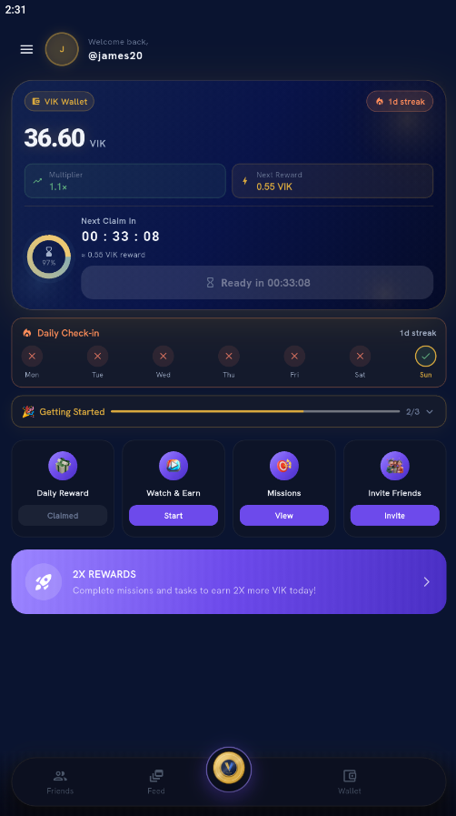
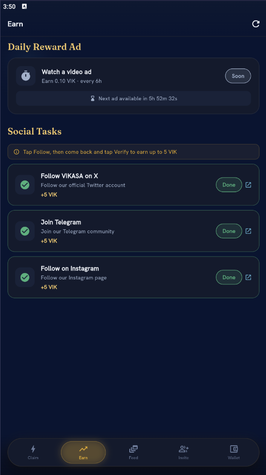
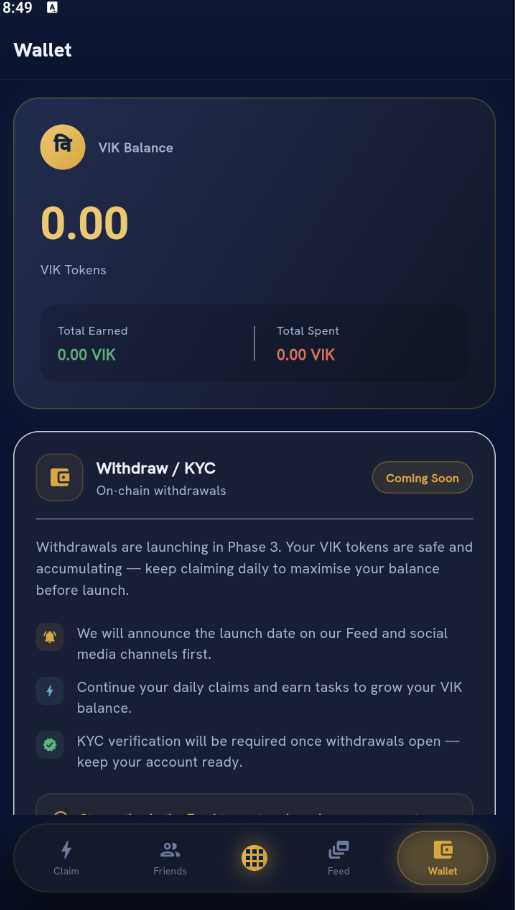
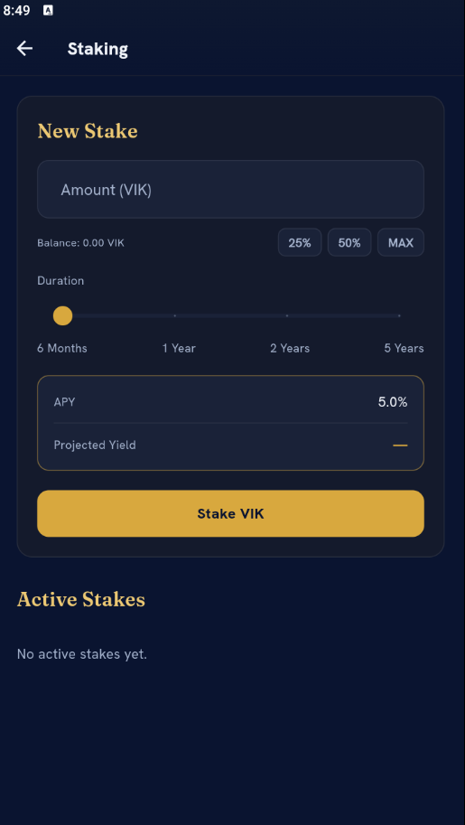
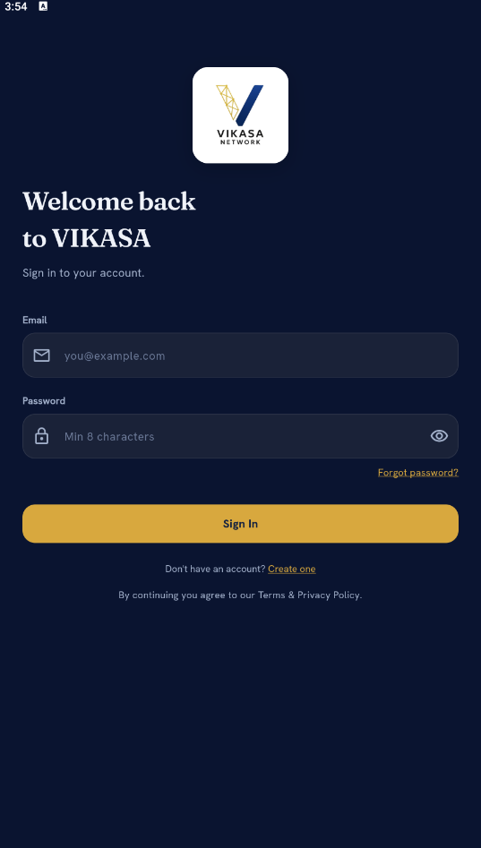
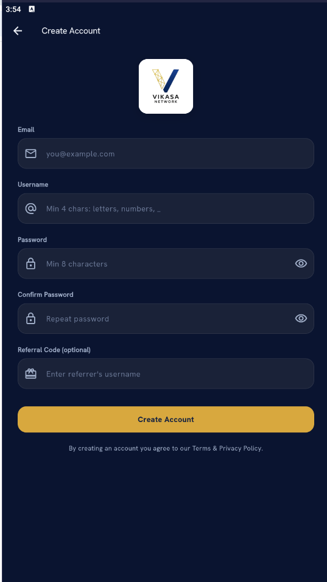

<p align="center">
  
</p>

<h1 align="center">Vikasa Network (VIK)</h1>

<p align="center">
A Polygon-based Web3 Rewards Ecosystem
</p>

<p align="center">


</p>

---

# 📖 Overview

Vikasa Network is a Polygon-powered Web3 rewards ecosystem built to encourage genuine participation through blockchain technology, community engagement, and a mobile-first experience.

Powered by the **VIK utility token**, the ecosystem rewards users for completing platform activities while maintaining transparency, verified smart contracts, and sustainable ecosystem growth.

---

# 📑 Table of Contents

- Overview
- Current Status
- Quick Links
- Application Preview
- Features
- Technology Stack
- Token Information
- Repository Structure
- Security
- Transparency
- Documentation
- Roadmap
- Disclaimer
- Contact

---

# 🚀 Current Status

| Component | Status |
|-----------|--------|
| Android Application | ✅ Live |
| Official Website | ✅ Live |
| Smart Contract | ✅ Deployed |
| PolygonScan Verification | ✅ Verified |
| Whitepaper | ✅ Published |
| GitHub Documentation | ✅ Public |
| Google Play | ✅ Live |
| Daily Rewards | ✅ Live |
| Daily Streaks | ✅ Live |
| Missions | ✅ Live |
| Achievements | ✅ Live |
| Referral Program | ✅ Live |
| Community Feed | ✅ Live |
| Private Messaging | ✅ Live |
| Leaderboards | ✅ Live |
| Staking | ✅ Live |
| Announcement System | ✅ Live |
| Withdrawals | ⏳ Phase 3 |
| Exchange Listings | ⏳ Future |
| Public Liquidity | ⏳ Future |

---

# 🌐 Quick Links

| Resource | Link |
|----------|------|
| 🌍 Website | https://www.vikasanetwork.com |
| 📱 Google Play | https://play.google.com/store/apps/details?id=com.vikasa.app |
| 📖 Whitepaper | https://www.vikasanetwork.com/whitepaper.pdf |
| 🔗 PolygonScan | https://polygonscan.com/token/0x2921d67ac78ebda0020f952e51e931ed125e00c1 |
| 💻 GitHub | https://github.com/vikasanetwork/vikasa-network-docs |
| 🐦 X | https://x.com/vikasanetwork |
| 💼 LinkedIn | https://www.linkedin.com/company/vikasanetwork |
| 📸 Instagram | https://www.instagram.com/vikasanetwork |
| 💬 Telegram | https://t.me/vikasanetwork |

---

# 📱 Application Preview

| Home | Earn | Wallet |
|------|------|------|
|  |  |  |

| Referral | Staking | Sidebar |
|------|------|------|
|  |  |  |

| Login | Registration | |
|------|------|------|
|  |  | |

---

# ✨ Features

## 🎁 Rewards

- Daily Rewards
- Daily Streak System
- Watch & Earn
- Daily Missions
- Weekly Challenges
- Monthly Challenges
- Community Challenges

## 🏆 Engagement

- Achievements
- User Titles
- Leaderboards
- Community Feed
- Private Messaging
- Announcement Center

## 👥 Growth

- 2-Tier Referral Program
- Referral Milestones
- Profile Progress
- Community Events

## 💰 Token Utility

- VIK Wallet
- Staking
- Transaction History
- Reward Logs
- Future Withdrawals (Phase 3)

---

# 🛠 Technology Stack

| Technology | Purpose |
|------------|---------|
| Flutter | Android Application |
| Supabase | Backend & Database |
| Polygon PoS | Blockchain Network |
| Solidity | Smart Contract |
| OpenZeppelin | ERC-20 Standard |
| Google AdMob | Rewarded Ads |
| Firebase Cloud Messaging | Push Notifications |

---

# 🪙 VIK Token

| Property | Value |
|----------|-------|
| Token Name | Vikasa Network |
| Symbol | VIK |
| Blockchain | Polygon PoS |
| Token Standard | ERC-20 |
| Decimals | 18 |
| Maximum Supply | 24,000,000 VIK |
| Supply Model | Fixed Supply |

## Smart Contract

```text
0x2921d67ac78ebda0020f952e51e931ed125e00c1
