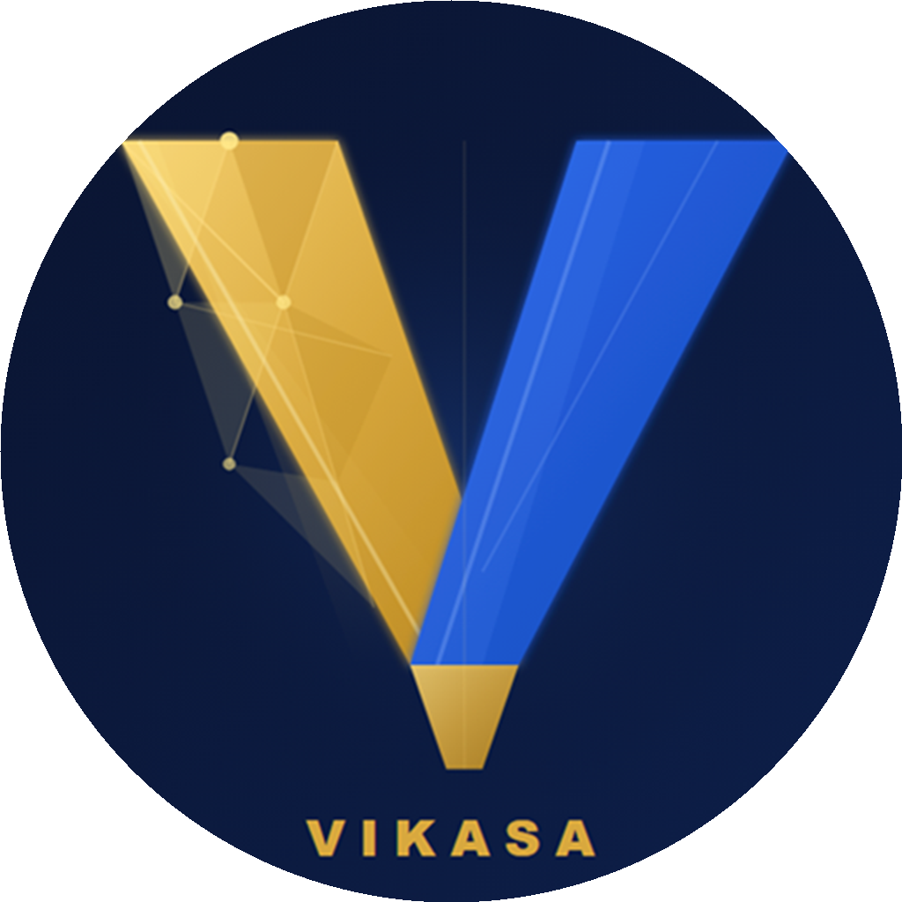
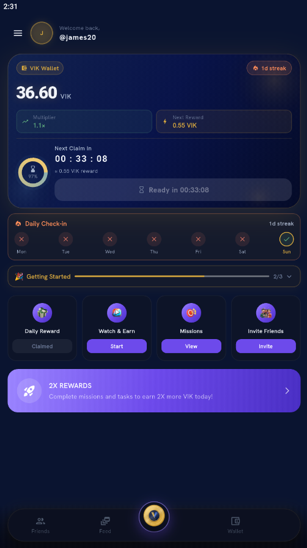
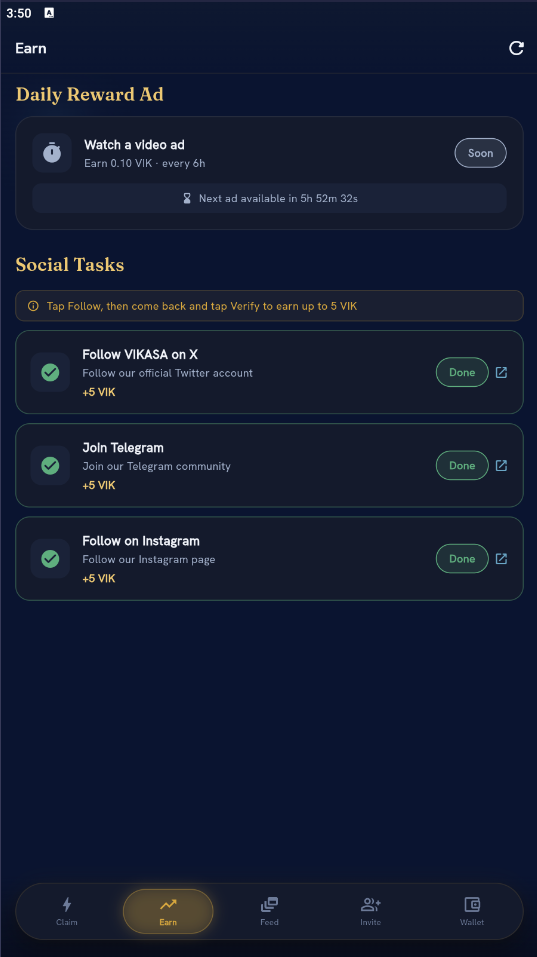
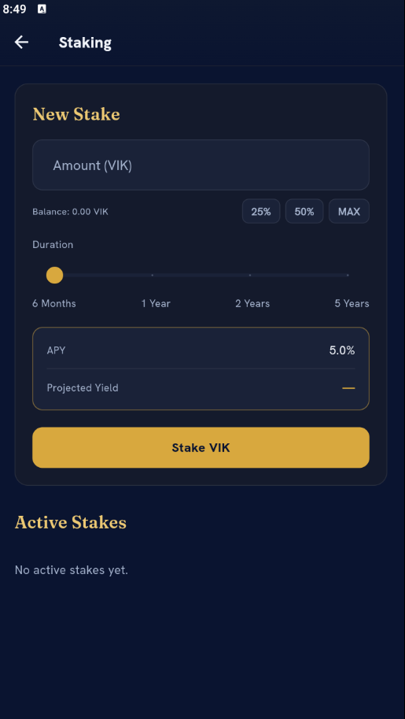
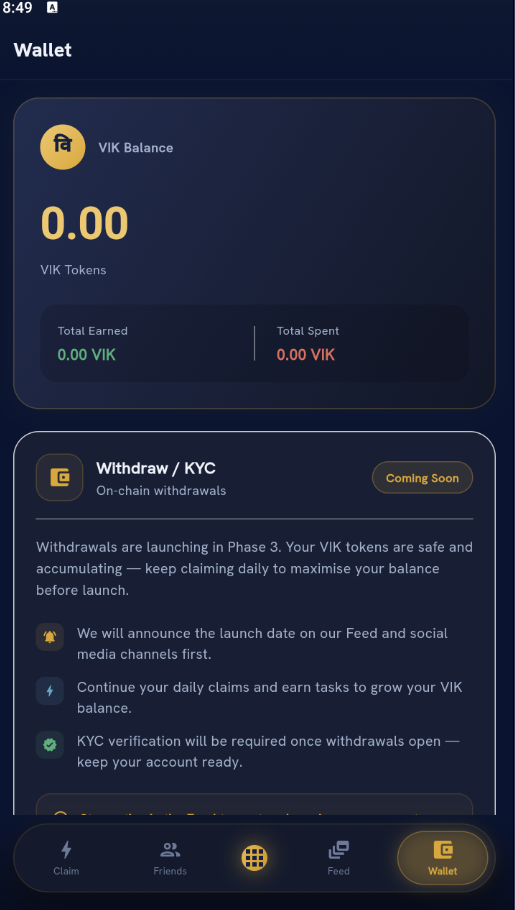
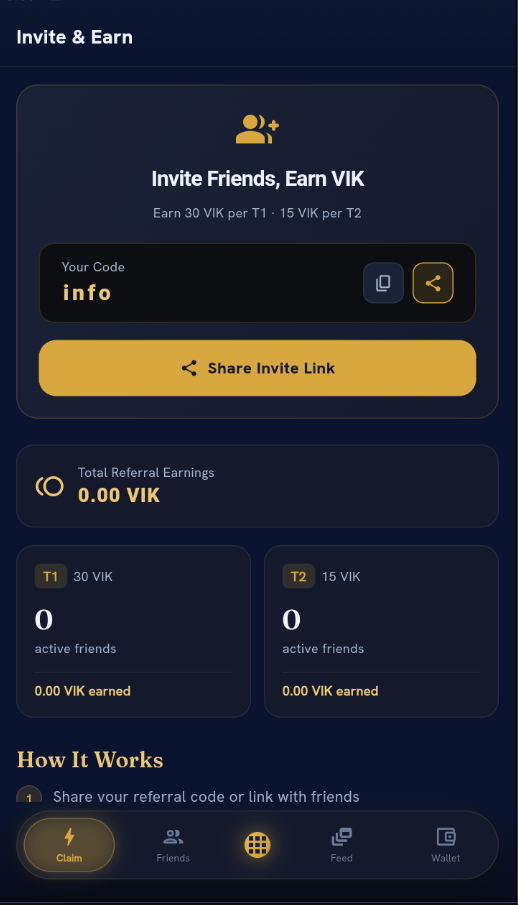

<p align="center">
  
</p>

<h1 align="center">Vikasa Network (VIK)</h1>

<p align="center">
  <strong>A Polygon-based Web3 Rewards Ecosystem</strong>
</p>

<p align="center">
  <a href="https://www.vikasanetwork.com">Website</a> •
  <a href="https://play.google.com/store/apps/details?id=com.vikasa.app">Android App</a> •
  <a href="https://polygonscan.com/token/0x2921d67ac78ebda0020f952e51e931ed125e00c1">Verified Contract</a> •
  <a href="https://blockspot.io/coin/vikasa-network-vik/">Blockspot</a> •
  <a href="https://github.com/vikasanetwork/vikasa-network-docs">Documentation</a>
</p>

<p align="center">
  
  
  
  
  
  
  
</p>

---

# Overview

Vikasa Network is a Polygon-based Web3 rewards ecosystem where users participate in daily activities, missions, referrals, community features and other eligible in-app activities to receive VIK rewards.

The project focuses on transparent on-chain infrastructure, community participation and long-term ecosystem utility.

VIK is an ERC-20 token deployed on Polygon PoS with a fixed maximum supply of 24,000,000 VIK.

External withdrawals are not currently available in Phase 1. Future withdrawal functionality is planned subject to independent security auditing, KYC, compliance and wallet-integration requirements.

---

# App Preview

| Home | Earn | Token Lock | Wallet | Referrals |
|:---:|:---:|:---:|:---:|:---:|
|  |  |  |  |  |

---

# Current Status

| Component | Status |
|-----------|--------|
| Android App | ✅ Live |
| Website | ✅ Live |
| Smart Contract | ✅ Verified |
| Whitepaper | ✅ Published |
| Documentation | ✅ Public |
| Daily Rewards | ✅ Live |
| Missions | ✅ Live |
| Referral Program | ✅ Live |
| Community Feed | ✅ Live |
| Direct Messaging | ✅ Live |
| Leaderboard | ✅ Live |
| Token Locking | ✅ Live |
| DEX Liquidity | ✅ Live |
| Uniswap V3 Pool | ✅ Live |
| Uniswap V4 Pool | ✅ Live |
| CoinGecko Listing Request | 🟡 Pending |
| Uniswap Default Token List PR | 🟡 Pending Review |
| Independent Audit | 🔜 Planned |
| Withdrawals | 🔜 Planned |
| KYC | 🔜 Planned |
| Additional Wallet Integration | 🔜 Planned |

---

# VIK Token

- **Token Name:** Vikasa Network
- **Symbol:** VIK
- **Network:** Polygon PoS
- **Standard:** ERC-20
- **Decimals:** 18
- **Maximum Supply:** 24,000,000 VIK
- **Supply Model:** Fixed / Hard Capped
- **Minting:** No additional minting
- **Contract:** `0x2921d67ac78ebda0020f952e51e931ed125e00c1`

The VIK token contract is deployed and verified on Polygon. The official whitepaper identifies the token as an ERC-20 asset on Polygon PoS with an 18-decimal, 24,000,000 VIK maximum supply. 

---

# Token Allocation

| Allocation | Amount | Percentage |
|------------|-------:|-----------:|
| Community Rewards | 12,000,000 VIK | 50% |
| Liquidity & Listings | 4,800,000 VIK | 20% |
| Ecosystem & Development | 3,600,000 VIK | 15% |
| Team & Advisors | 2,400,000 VIK | 10% |
| Strategic Reserve | 1,200,000 VIK | 5% |
| **Total** | **24,000,000 VIK** | **100%** |

---

# DEX Liquidity

VIK liquidity is currently available on Polygon through decentralized-exchange pools.

## Uniswap V3

**Pair:** VIK / USDT  
**Network:** Polygon PoS  
**Fee Tier:** 0.30%

GeckoTerminal pool:

https://www.geckoterminal.com/polygon_pos/pools/0x03b1200486d67e92cf535503a4a8f7828005d1f3

## Uniswap V4

VIK/USDT liquidity is also available through an existing Uniswap V4 position on Polygon.

Liquidity is being developed progressively as part of the project's ecosystem growth strategy.

**Important:** DEX liquidity availability does not represent a guarantee of token value, price stability, returns or future market performance.

---

# CoinGecko Listing

Vikasa Network has submitted an official CoinGecko listing request.

- **Request ID:** `CL2209260003`
- **Status:** Pending
- **GeckoTerminal:** https://www.geckoterminal.com/polygon_pos/pools/0x03b1200486d67e92cf535503a4a8f7828005d1f3

The listing request is currently under CoinGecko review.

CoinGecko listing status should not be interpreted as an endorsement or guarantee of market availability.

---

# Uniswap Token List

Vikasa Network has submitted a token-list pull request to the official Uniswap default-token-list repository.

- **PR:** #2520
- **Repository:** https://github.com/Uniswap/default-token-list
- **Status:** Open / Pending Maintainer Review
- **Automated Checks:** Passing
- **Token:** Vikasa Network (VIK)
- **Network:** Polygon PoS

PR:

https://github.com/Uniswap/default-token-list/pull/2520

The PR has passed the available automated security checks and is awaiting the required maintainer review/workflow approval.

Inclusion in the Uniswap default token list is not currently confirmed.

---

# Transparency & Security

VIKASA maintains publicly accessible project and token information.

Current verification resources include:

- PolygonScan verified smart contract
- GoPlus token security analysis
- Public GitHub documentation
- Published whitepaper
- Blockspot project listing
- Public token contract information
- Public DEX liquidity information

Independent smart contract auditing is planned before external withdrawal functionality is activated.

Security information:

https://www.vikasanetwork.com/security

The project does not represent the current contract verification or third-party security scans as a substitute for an independent smart contract audit.

---

# Features

- Daily Rewards
- Daily Claim
- Daily Streaks
- Watch & Earn
- Social Tasks
- Missions
- Referral Program
- Community Feed
- Private Messaging
- Group Community Chat
- Leaderboards
- Token Locking
- Push Notifications
- KYC Module
- Ecosystem Wallet Interface

Some features, including external withdrawals and additional wallet functionality, remain planned for future phases.

---

# How VIKASA Works

### 1. Create an Account

Users can create a VIKASA account and access the core application without purchasing VIK.

### 2. Participate

Users can participate in eligible daily activities, rewarded advertisements, social tasks, missions and referral activities.

### 3. Receive VIK Rewards

Eligible activities can result in VIK rewards credited within the VIKASA ecosystem.

### 4. Participate in the Ecosystem

Users can access community features, leaderboards, referrals and VIK token-locking functionality.

External withdrawals are not currently available in Phase 1.

---

# Token Locking

VIKASA provides token-locking functionality for ecosystem participation.

Current lock periods include:

- 6 Months
- 1 Year
- 2 Years
- 3 Years

Token locking is designed around ecosystem participation and standing.

**Important:** VIK locking is not presented as a guaranteed-interest or guaranteed-APY product. No fixed financial return is promised.

---

# Technology Stack

- Flutter
- Supabase
- Polygon PoS
- Solidity
- OpenZeppelin
- Firebase Cloud Messaging
- Google AdMob

---

# Roadmap

## Phase 1 — Launch & Earn ✅

**Status: Live**

- Android application
- Daily reward claims
- Rewarded advertisements
- Social tasks
- Missions
- Referral program
- Community feed
- Direct messaging
- Leaderboards
- VIK token locking

---

## Phase 2 — Trust & Access 🔜

Planned development includes:

- Independent smart contract audit
- Public audit report
- KYC integration
- Planned withdrawal functionality
- iOS application
- Polygon wallet integration
- Additional wallet ecosystem support
- Premium membership features

Withdrawal functionality remains subject to security, compliance and technical readiness.

---

## Phase 3 — Markets & Governance 🔮

Planned ecosystem expansion includes:

- DEX liquidity expansion
- CoinGecko tracking/listing
- CoinMarketCap tracking/listing
- WalletConnect
- NFT rewards
- DAO governance
- CEX listing applications
- Additional ecosystem integrations

These are planned milestones and are not guarantees of future listings, integrations or market availability.

---

# Official Links

- **Website:** https://www.vikasanetwork.com
- **Android App:** https://play.google.com/store/apps/details?id=com.vikasa.app
- **Whitepaper:** https://www.vikasanetwork.com/whitepaper.pdf
- **PolygonScan:** https://polygonscan.com/token/0x2921d67ac78ebda0020f952e51e931ed125e00c1
- **GitHub Documentation:** https://github.com/vikasanetwork/vikasa-network-docs
- **Blockspot:** https://blockspot.io/coin/vikasa-network-vik/
- **GeckoTerminal:** https://www.geckoterminal.com/polygon_pos/pools/0x03b1200486d67e92cf535503a4a8f7828005d1f3
- **Uniswap Default Token List PR:** https://github.com/Uniswap/default-token-list/pull/2520
- **X:** https://x.com/vikasanetwork
- **Telegram:** https://t.me/vikasanetwork
- **LinkedIn:** https://www.linkedin.com/company/vikasanetwork
- **Instagram:** https://www.instagram.com/vikasanetwork

---

# Documentation

The public documentation repository contains project documentation, token information, assets and supporting materials.

GitHub:

https://github.com/vikasanetwork/vikasa-network-docs

---

# Contract Information

**VIK Contract:**

```text
0x2921d67ac78ebda0020f952e51e931ed125e00c1
